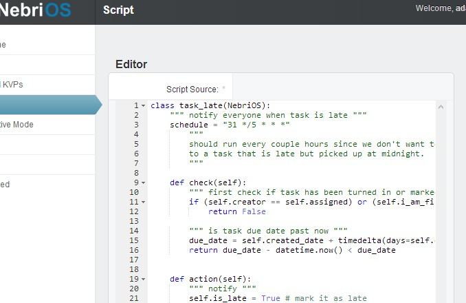
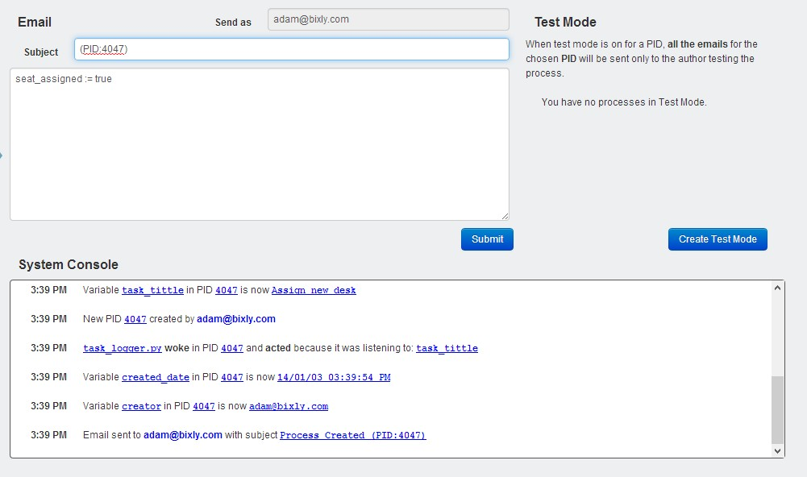

Nebri OS Guide
==============

Documentation to help you quickly setup Nebri OS for your organization.

Overview
--------

Scripts, KVPs, and the Inbox. These are the major pieces of Nebri OS. Scripts are authored through a text editor in the admin area. Adding just a few commands to a Python script inside the Nebri OS environment allows you to create powerful "processes" quickly. Nebri OS is different, and here are a few bullet points to summarize:

-  Nebri OS thinks in terms of tasks and environment rather than processes
-  The Inbox is king here. All other tools are secondary. Thus, user adoption is automatic.
-  Scripts are called into action through a KVP change in the system.
-  As long as your script is listening to something that changes, and it's check is True, it will run.
-  Scripts don't call other Nebri OS scripts, but events trigger them.
-  Because of this logical power, BPA, Contracts, CEP and others happen naturally.

The power that the Nebri OS paradigm provides is extreme, but it's important to understand some of the main features of the tool before moving on. Traditional BPM systems revolve around a process, while Nebri OS revolves around scripts that react to events. Think about an army of minions, each with a single role of operation and single assignment.

A traditional BPMN process can be replaced with a set of scripts. The power is that you don't need a predefined process, you just need to understand a nugget of functionality that you want: When the warehouse stock falls below 100, email this person, and setup an order.

It takes a little while to wrap your mind around it, because tasks/scripts interact with the environment, not a process or other Nebri OS scripts. One problem that we solved by taking this angle is that we never have a problem communicating across various processes in action since it's just the environment. This paradigm allows you to modify "processes" on the fly with zero side effects, and build your library of scripts up organically.

Writing Scripts
---------------

A few things to note about scripts:

-  Scripts must be called into action through a KVP change in the system. They don't act otherwise.
-  As long as your script is listening to something that changes, and it's check is True, it will run.
-  Scripts don't call or reference other Nebri OS scripts, but events trigger them.

This section will provide an overview of how to write Nebri Scripts.
 **If you would a more detailed step-by-step tutorial on writing Nebri Scipts, `read more here! </tutorial>`_**

Listening
~~~~~~~~~

Since Nebri OS scripts don't ever execute by being called, you will need to specify what KVPs in the system, when created or changed, will trigger the script. This is done by using the listens\_to list. It can contain any number of KVPs to watch. Usually other scripts, or incoming emails will change KVPs, and thus trigger your script.

This is the listens\_to list.

::

    class my_class_name(NebriOS):
        listens_to == ['some_value']
                    

"some\_value" is the KVP that you are telling your system to react to. As an example, let's say we want to watch vacation\_request KVP. That way, if anyone sent in an email to your Nebri OS Inbox with something like "vacation\_request := True", the script would wake up, and try to move on.

Listening to multiple KVPs looks like this:

::

    listens_to == ['some_value', 'foo', 'bar']
                  

If any one of those KVPs were to change, the script would wake up.

**Note:**\ You can listen to every single KVP system wide by using \* instead of a text value.

**Read more: `Writing Scripts - Registration </tutorial#registration>`_**

Checking
~~~~~~~~

The check feature allows you to set parameters that must be met in order to run. Since scripts are naturally hungry, they want to run any time their watched KVP has been created or changed. The check feature introduces a load of power. For instance, only run the "order" command if the bank account is high enough. We are supposing your system is tied into Nebri OS, and the bank balance is available to it.

Script only gets to check() if this changes

Script only fires if check passes

::

    def check(self):
        return bank_balance > order_total
                  

"return" is a Python feature. It's the final output of check(). In this case, it's going to return a True if bank\_balance is greater than the order\_total.

You can run anything in this function. We don't recommend changing data during a check(), since that is considered breaking command-query separation.

Since this is pure Python, you can easily query some outside service and use that in your arguments. An example might be weather temperature or status of a file transfer. It's Python!

**Read more: `Writing Scripts - Check Method </tutorial#check_method>`_**

Executing
~~~~~~~~~

Anything under the action() function gets executed IF the script is woken up (based on what it listens\_to), AND the check() has returned as True. There is where emails are sent, logic is evaluated, APIs are called, other KVPs are set.

Send an email to anybody

Changing a KVP

Example gtalk plugin

::

    def action(self):
        send_email("email", """message""")
        self.vacation_status == "Finished"
        gtalk.send("recipient", """message""")
                  

Once you have a listens\_to, check() and an action(), you have the general body of a script.
 Check out the `Demo <demo>`_ for some script examples!

**Read more: `Writing Scripts - Action Method </tutorial#action_method>`_**

Process Contracts
~~~~~~~~~~~~~~~~~

There are two main types of Nebri script architecture. **Process scripts** monitor fewer things but usually make more changes. These allow you to make traditional processes quickly, and with extreme logical engineering. **Process Contract** is a defensive, robust-ifying type of script that adds assurance to your process. These type of scripts have a broader listens\_to scope, and will send reports or alerts if something looks off. No new syntax required, it's just the scope and parameters used.

Power alert! Process Contract scripts act as watchdogs. They monitor and report over a broad range of KVPs in the system, and help ensure the system is working as you expect. Think of them as contracts between you and the system. Some examples of scripts that would fall into this category:

-  Check if any sales process (any PID with a KVP of lead := True) has been idle for over a week.
-  Verify no new candidates are outright rejected if their test was over 95%
-  Check that the alarm in the building is never on when you are there. (Supposes integration of course)
-  Verify a customer never has a project kickoff meeting without having a verified payment method.

Since Nebri OS allows you to work with the environment without the constraints of a process, it's mind boggling how much assurance can be built into a system.

Scripting Reference
-------------------

schedule[]
~~~~~~~~~~

These are related to `Drips <#Drips>`_ but are quite different. Schedules allow you to wake a script up on a repeating schedule and try to run against **EVERY** PID in the system. This is useful for monitoring processes within your system, making sure they are moving along, aren't missing anything, and for many other uses.

**Read more: `Writing Scripts - Schedule </tutorial#schedule>`_**

required()
~~~~~~~~~~

This feature allows you to define in a script certain KVP values which **must** be available to the script before it continues forward. An example would be a list of paperwork. Each item must be inputted into the system before the script moves forward.

If the required KVPs aren't there when the script executes, it sends an email back to the last actor telling them they missed certain information.

**Read more: `Writing Scripts - Required </tutorial#required>`_**

instances\_within\_process()
~~~~~~~~~~~~~~~~~~~~~~~~~~~~

::

    def action(self):
        print("This action has fired "+ self.instances_within_process() +" inside this PID")

When creating an action you can see if the action has already ran, relative to the process you are standing in. This is useful to create a "singleton" type action, or make sure only an actions runs a specified number of times. For example an alarm set to notify you when stock is low could trigger a new action hundreds of times unless you check that the action in question has already ran for that PID. **instances\_within\_process** is for checking all the occurrences of the action within a single processes id. **instances\_within\_system** checks system wide, no matter the process ID.

instances\_within\_system()
~~~~~~~~~~~~~~~~~~~~~~~~~~~

::

    def action(self):
        print("This action has fired "+ self.instances_within_system() +" times system wide")

When creating an action you can see if the action has already ran system-wide. This is useful to create a "singleton" type action, or make sure only an actions runs a specified number of times. For example an alarm set to notify you when stock is low could trigger a new action hundreds of times unless you check that the action in question has already ran globally anywhere in the system.

send\_email()
~~~~~~~~~~~~~

::

     # all params
    send_email(TO,MESSAGE [,SUBJECT,PID,ATTATCH_VARIABLES])

    # example
    send_email("ted@examples.com", '''Hey Ted! Can I get approval for the shipments?''')

A very important feature of NebriOS is the ability to send email without any hassle. The syntax has been kept simple, and some powerful options built in. Here's additional usage examples:

::

    # sending to multiple people 
    send_email("fred@examples.com, wilma@example.com, dino@email.com", 
        '''Hey Team! Can I get approval for the shipments?''')

    # Additional arguments include subject:
    send_email(TO,MESSAGE,"Subject Here (PID:%s)" % self.different_pid)
    # This isn't ideal, and will be cleaned up in the future, but you have to reference the PID in the subject or else it doesn't get sent in the email. You are free to add whatever else you like to the subject.

    # And PID
    send_email(TO,MESSAGE,SUBJECT, PID)
    # The PID argument allows you to change which PID the KVP's at the bottom of the email gets loaded from.

**to** can contain any number of comma separated email addresses. **message** can contatain anything within tripples quotes, along with being able to pring kvp's using brackets {{like\_this}}. If you don't want to show all the kvp's in the emails, send **attatch\_variables=False**. By default it's set to true.

process\_started\_time
~~~~~~~~~~~~~~~~~~~~~~

This shows the time, as a timestamp, when the PID you are standing in was started. It's useful for understanding how long a process has been going on and reacting to it with other rules.

::

    def action(self):
        print self.process_started_time

Processes And Your Inbox
------------------------

The Inbox is the easiest path to organizational integration. Emails are sent to the system (e.g. acme@nebrios.com) and KVPs extracted and entered. Anything in the format of "foo := bar" will be entered into the system as a KVP. See, each email that is sent into Nebri OS is either A) initializing a process if it didn't exist yet, or B) responding to a process or modifying one already in motion. You will know what process you are interacting with because the Process ID will show up in the subject line. (PID:15) would tell us that PID 15 is the process we are in.

To illustrate why this is important, imagine you hire on two new people. They will both have the same type of info, like first\_name, last\_name, pay\_rate for instance. But you need to be able to track information about their status separately. The first hire that you bring on can be activated from an email like this:

::

    first_name := Ted
    last_name := Halogen
    new_hire := True

If you sent that email into Nebri OS, and a script was monitoring the new\_hire KVP, things would be set in motion. Since this process is just starting, you would get an email letting you know that a new PID (let's say PID:1) was just created to accommodate the new information. Then, let's say you get another new hire, and want to start a process for her:

::

    first_name := Jill
    last_name := Nanomo
    new_hire := True

A brand new process would be created, such as PID 2. Now the lanes are clearly established, and you and other managers can fully interact with the new hires separately.

Attachments
~~~~~~~~~~~

Attachments are handled in a special way. Each attachment you email to Nebri OS gets associated with the PID in question and becomes available as a KVP. The KVP of that attachment is the URL that can be used to access the attachment by anyone privy to the process. So, if you email an attachment, the next person to interact with the PID will get an email with an additional KVP listed at the bottom of the KVP table that goes with every email. This KVP will be a link to the file that was sent in as an attachment. It will be forever available.

Composing Emails
~~~~~~~~~~~~~~~~

The rules to composing emails are actually very easy. A lot of work has been put in to ensure that any KVP can be pulled from any email. It's best to use this format: **name := value**. If multiple KVPs are found contradicting each other in the same email, the first one processed is the one that is used. Also, the KVPs can be pulled from any area of the email: the response, the main body, signature, whatever.

For documentation purposes, or just being more expressive to the other people you are cc'ing, you can do something like this:

::

    to: max@acme.com, heather@acme.com, acme@nebrios.com

    Hey Guys, 
    I just wanted to let you know I have to request more budget 
    for this next quarter because of the sales slump. Feel free
    to chat with me about it.

      additional_budget_request := 5000
      department := widgets

This allows you to interact with people and a defined structure in a natural way.

Printing KVPs
~~~~~~~~~~~~~

It's very easy to send dynamic information via email via the print syntax. Anything encompassed in double braces, {{like\_this}}, will be printed if it represents a variable/KVP within the database. Here's an example of an email that is composed from a script to be sent out to other people involved in the process:

::

    Hello HR, 
    A new employee named {{employee_name}} is now waiting to be processed.

If that variable exists in the system, for the PID in question, it will get printed in the email. If it's not available, it will just be blank. No error will be thrown to the user.

Syntax Notes
~~~~~~~~~~~~

It works like variables inside of most programming languages. If you use spaces, surround them in quotes. "this is valid". For multi line strings, put them in triple quotes. Other symbols and numbers are fine.

Forms
-----

Forms a gernerally the fastest way to interact with NebriOS. With very simple scripts you can create forms that allow users in your system to accuratly submit and interact with a large ammount of information. It's also likely that you want to create a form for users outside your system, a survey perhaps, which is also possible. Those are called public forms. Let's see what a form looks like.

Here's an `example form <https://demo.nebrios.com/interact/hello_form>`_ and here's the `code <https://scripts.nebrios.com/adamnebbs/demo-form-with-every-option/>`_ it took to produce it.

Forms are written in the forms area that you can find in the left navigation. An minimal form might look like this:

::

    class my_form(Form):
        first_name = String()
        age = Number()

Available Options
~~~~~~~~~~~~~~~~~

Here's another example form with inline comments. You can copy the script into your environment to see what it will look like, or `see it live <https://demo.nebrios.com/interact/explainer_form>`_ right now.

::

    class explainer_form(Form):

        # validation for any form field is possible
        # will warn the user if it's raised
        def validate_10_scale(form, field, value):
            if (value < 0) or (value > 10):
                raise ValidationError('Value must be between 1 and 10')

        # if you want to override the default title (the class name)
        form_title = "Tutorial Form"

        form_instructions = "I can put comments here about what you should do on the form."

        # 'name' here will turn into a KVP and recieve any value
        # that is collected from this form
        name = String()

        # labels print above the form box
        age = Number(label="Provide your age")

        # initial will fill in the value upon loading
        # you can fill it with other KVP's also
        favorite_number = Number(initial=42)

        # validation points to a function you have written
        # if it can't pass validation it is sent back to the user
        # for example, can't be above 10 or below zero
        ice_cream_rating = Number(message="1-10 - How much do you like Ice Cream?", validation=validate_10_scale)

        # some fields are very important, so mark them as required.
        you_are_alive = Boolean(required=True)

        # bools can be dropdowns also
        bool_drop_down = Boolean(initial=False, dropdown=True)

        # or radio
        bool_radio = Boolean(initial=False, radio=True)

        # combo box as a string
        combo_box_string = String(choices=[('AK', 'Arkansas',),('CA', 'California',)])

        # combo box as a number
        combo_box_number = Number(choices=[(1, 'One',),(2, 'Two',)])

        # allow multiple selectection
        multi_box_one = String(choices=[(1, 'One',),(2, 'Two',)], multiselect=True)

        # date/time selection and input
        when = DateTime(initial=datetime.now())

        # time selection only
        requested_time = Time(initial=datetime.now())
      

Acessing Forms
~~~~~~~~~~~~~~

There are two ways to show a form: You can click on a link from anywhere like the admin, an email, or a wiki page, or you can bring forms up automatically once a user submits an initial form. This way you can continue to click through forms and experience the flow of the application quickly, dynamically. Any mention of a form in the send\_email() for the user looking at the Interactive page will bring the very same form up in their browser. In other words, a form link will be sent to their inbox, but if they have the Interactive view open in their browser, the form that was passed to them in the email will show up right away.

The syntax for linking a form is **{{forms.example\_form}}** from inside any send\_email message. The email being sent out will render it as a full http link. This method of linking forms will be expanded once load\_form and load\_message features are introduced, but they aren't available to our users yet.

Public Forms
~~~~~~~~~~~~

Are there times you want to interact with large amount of users, but without them being an official user in your system? Think about a survey, or ordering something off a menu. These users don't need access to your system, and they will not be interacting very often with Nebri. It's best to use public forms in this case.

What's surprising is that you don't actually create a public form. Anyone is able to reach any form on your Nebri instance, in essence, but of course nothing would come up unless you had allowed it in your ACL. That means, in order to make a form public, you must make the ACL on the KVP's inside the form accessible to the public. **Just send anyone a link to your form. If the ACL allows, that's it!**

                    

